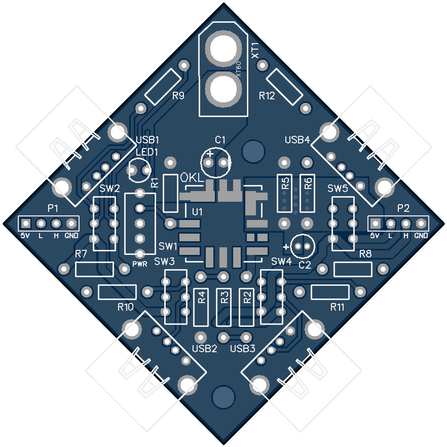
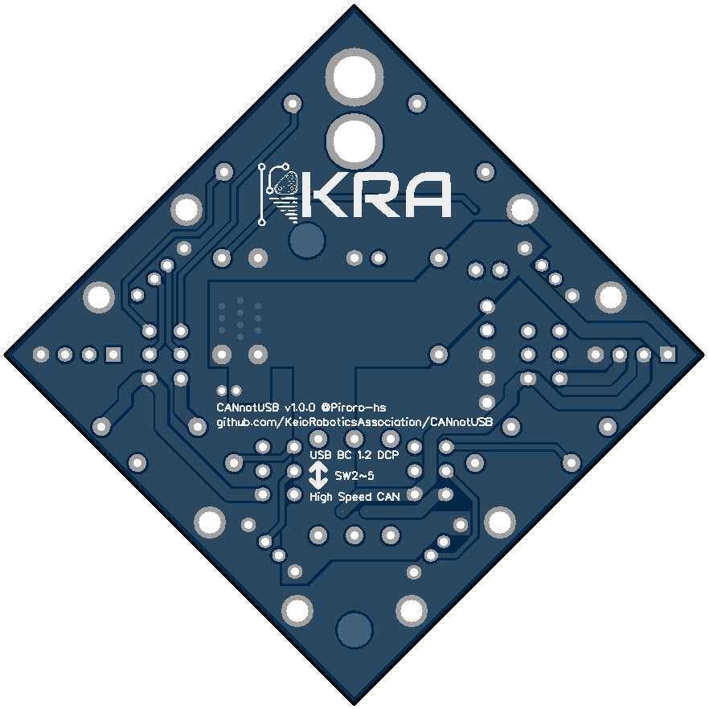
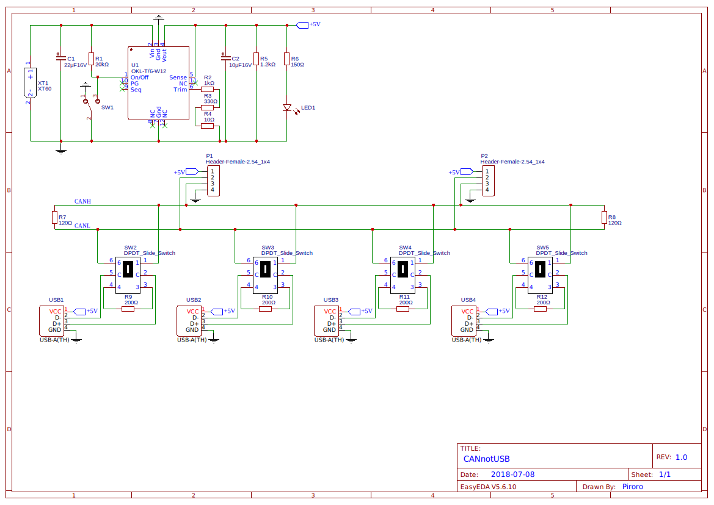

# CANnotUSB
https://easyeda.com/Piroro/CAN-not-USB

## 回路図

電源部分は大体[これ](https://github.com/KeioRoboticsAssociation/Power_Supply)と同じ

## 部品表
|番号|部品名|個数|備考|
|:-|:-|:-|:-|
|XT1|XT60コネクタ（オス）|1|オス・メスを間違えやすいので気をつけて。ラジコンショップで売ってる|
|P1,2|1×4ピンヘッダ|2|ピンソケット或いは省略しても良い|
|USB1~4|USBコネクタ（Aメス） [5075AR-04-WH](http://akizukidenshi.com/catalog/g/gC-00160/)|4|サイズが合えば何でも|
|U1|DCDCコンバータ OKL-T/6-W12|1|[OKL-T/6-W12N-C](http://akizukidenshi.com/catalog/g/gM-06187/)を想定してるけど同シリーズなら動くはず|
|SW1|SPDTトグルスイッチ [2MS1-T2-B4-VS2-Q-E-S](http://akizukidenshi.com/catalog/g/gP-12407/)|1|サイズが合えば何でも|
|SW2~5|DPDTスライドスイッチ [IS-2235](http://akizukidenshi.com/catalog/g/gP-02627/)|4|サイズが合えば何でも|
|LED1|3mmLED|1||
|C1,2|回路図参照|計2|電解コンデンサ|
|R1~12|回路図参照|計12||

※注意：はんだ付けするときは背の低い部品からつけていくと良い。U1は最初につけるべし。
